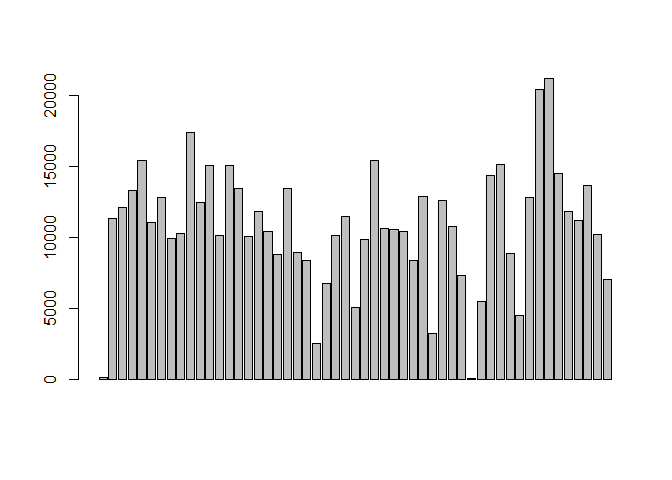
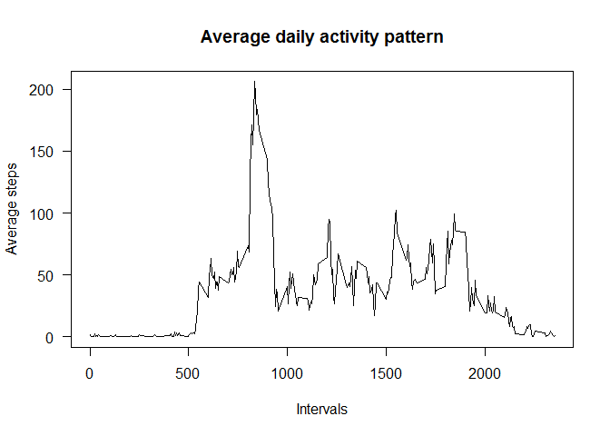
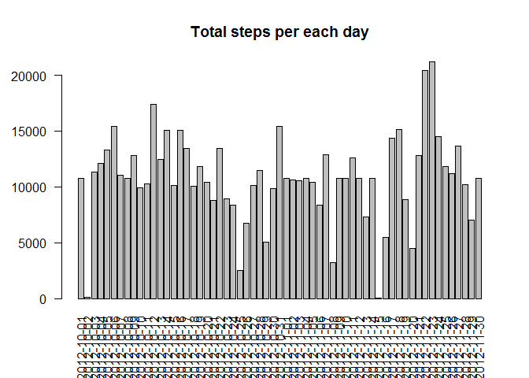

# Reproducible Research: Peer Assessment 1


## Loading and preprocessing the data

```r
library(data.table)
data <- read.csv("activity.csv", header = TRUE)
data$date <- as.Date(strptime(data$date, "%Y-%m-%d"))
head(data)
```

```
##   steps       date interval
## 1    NA 2012-10-01        0
## 2    NA 2012-10-01        5
## 3    NA 2012-10-01       10
## 4    NA 2012-10-01       15
## 5    NA 2012-10-01       20
## 6    NA 2012-10-01       25
```

## What is mean total number of steps taken per day?

```r
stepsperday <- aggregate(.~date,data=data[,1:2],sum)
head(stepsperday)
```

```
##         date steps
## 1 2012-10-02   126
## 2 2012-10-03 11352
## 3 2012-10-04 12116
## 4 2012-10-05 13294
## 5 2012-10-06 15420
## 6 2012-10-07 11015
```

```r
barplot(stepsperday$steps, las=2, names.arg=stepsperday$date)
title(main="Total steps per each day")
```

 

```r
mean(stepsperday$steps)
```

```
## [1] 10766
```

```r
median(stepsperday$steps)
```

```
## [1] 10765
```

## What is the average daily activity pattern?

```r
avgstepsperint <- aggregate(.~interval, data=data[,c(1,3)], mean)
head(avgstepsperint)
```

```
##   interval   steps
## 1        0 1.71698
## 2        5 0.33962
## 3       10 0.13208
## 4       15 0.15094
## 5       20 0.07547
## 6       25 2.09434
```

```r
plot(avgstepsperint$interval, avgstepsperint$steps, type="l", ylab="", xlab="", las=1)
title(main="Average daily activity pattern", ylab="Average steps", xlab="Intervals")
```

 

#### The following 5-minute interval contains the maximum number of steps:

```r
avgstepsperint$interval[avgstepsperint$steps == max(avgstepsperint$steps)]
```

```
## [1] 835
```

## Imputing missing values

#### Total number of missing values in the data is 2304 as you can see in the below result:

```r
missing <- is.na(data)
table(missing)
```

```
## missing
## FALSE  TRUE 
## 50400  2304
```

#### The following few steps will create a new dataset which is the same as the original, but all the NAs are replaced by the mean of the steps per each interval:

```r
tempdata <- merge(subset(data, missing), avgstepsperint, by = "interval")
tempdata <- tempdata[order(tempdata[,3], tempdata[,1]),]
head(tempdata)
```

```
##    interval steps.x       date steps.y
## 1         0      NA 2012-10-01 1.71698
## 10        5      NA 2012-10-01 0.33962
## 17       10      NA 2012-10-01 0.13208
## 29       15      NA 2012-10-01 0.15094
## 33       20      NA 2012-10-01 0.07547
## 45       25      NA 2012-10-01 2.09434
```

```r
data2 <- data
head(data2)
```

```
##   steps       date interval
## 1    NA 2012-10-01        0
## 2    NA 2012-10-01        5
## 3    NA 2012-10-01       10
## 4    NA 2012-10-01       15
## 5    NA 2012-10-01       20
## 6    NA 2012-10-01       25
```

```r
data2[missing] <- tempdata[,4]
missing2 <- is.na(data2)
table(missing2)
```

```
## missing2
## FALSE 
## 52704
```

```r
head(data2)
```

```
##     steps       date interval
## 1 1.71698 2012-10-01        0
## 2 0.33962 2012-10-01        5
## 3 0.13208 2012-10-01       10
## 4 0.15094 2012-10-01       15
## 5 0.07547 2012-10-01       20
## 6 2.09434 2012-10-01       25
```

#### Total number of steps per day taken based on the new dataset

```r
stepsperday2 <- aggregate(.~date,data=data2[,1:2],sum)
head(stepsperday2)
```

```
##         date steps
## 1 2012-10-01 10766
## 2 2012-10-02   126
## 3 2012-10-03 11352
## 4 2012-10-04 12116
## 5 2012-10-05 13294
## 6 2012-10-06 15420
```

```r
barplot(stepsperday2$steps, las=2, names.arg=stepsperday2$date)
title(main="Total steps per each day")
```

 

```r
mean(stepsperday2$steps)
```

```
## [1] 10766
```

```r
median(stepsperday2$steps)
```

```
## [1] 10766
```

#### What is the impact of imputing missing data on the estimates of the total daily number of steps?
Total daily number of steps have been increased on those days where any NAs were replaced by the mean of the average steps per the particular interval.

## Are there differences in activity patterns between weekdays and weekends?

```r
Sys.setlocale("LC_TIME", "C")
```

```
## [1] "C"
```

```r
day <- factor(c("weekday", "weekend"))
data2[weekdays(data2$date) %in% c("Monday", "Tuesday", "Wednesday", "Thursday", "Friday"),4] <- "weekday"
data2[weekdays(data2$date) %in% c("Sunday", "Saturday"),4] <- "weekend"
colnames(data2)[4] <- "day"
head(data2)
```

```
##     steps       date interval     day
## 1 1.71698 2012-10-01        0 weekday
## 2 0.33962 2012-10-01        5 weekday
## 3 0.13208 2012-10-01       10 weekday
## 4 0.15094 2012-10-01       15 weekday
## 5 0.07547 2012-10-01       20 weekday
## 6 2.09434 2012-10-01       25 weekday
```

```r
table(data2$day)
```

```
## 
## weekday weekend 
##   12960    4608
```
