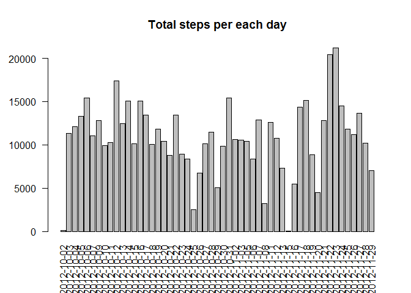

# Reproducible Research: Peer Assessment 1


## Loading and preprocessing the data

```r
library(data.table)
data <- read.csv("activity.csv", header = TRUE)
data$date <- as.Date(strptime(data$date, "%Y-%m-%d"))
head(data)
```

```
##   steps       date interval
## 1    NA 2012-10-01        0
## 2    NA 2012-10-01        5
## 3    NA 2012-10-01       10
## 4    NA 2012-10-01       15
## 5    NA 2012-10-01       20
## 6    NA 2012-10-01       25
```

## What is mean total number of steps taken per day?

```r
stepsperday <- aggregate(.~date,data=data[,1:2],sum)
head(stepsperday)
```

```
##         date steps
## 1 2012-10-02   126
## 2 2012-10-03 11352
## 3 2012-10-04 12116
## 4 2012-10-05 13294
## 5 2012-10-06 15420
## 6 2012-10-07 11015
```

```r
barplot(stepsperday$steps)
```

 

```r
mean(stepsperday$steps)
```

```
## [1] 10766
```


## What is the average daily activity pattern?


## Imputing missing values


## Are there differences in activity patterns between weekdays and weekends?
